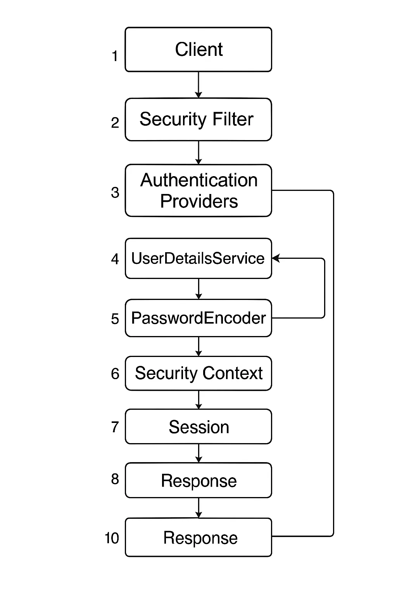

## 1. 클라이언트 요청

- 엔드포인트로 HTTP 요청

> 누군가 건물 출입구에 우편을 가져옴
>

## 2. Security Filter

- 모든 요청은 Spring Security 필터 체인으로 가로채짐
- 인증 필요시 로그인 페이지로 리다이렉트

> 현관앞 도어맨이 우편 봉투를 받아 확인
>

## 3. Authentication 객체 생성

- HTTP 요청 내에서 자격 증명 추출

```java
// 1. Authentication 객체 생성
//    - 주로 UsernamePasswordAuthenticationToken 사용
//    - 생성 시 isAuthenticated=false
Authentication authenticationToken =
    new UsernamePasswordAuthenticationToken(username, password);

// 내부 필드
//   principal    : 사용자 식별자 (String username 또는 UserDetails 객체)
//   credentials  : 사용자 제공 비밀번호(raw password)
//   authorities  : 빈 컬렉션 (인증 전이라 권한 정보 없음)
//   details      : 요청 정보(WebAuthenticationDetails, IP·세션ID 등)
//   authenticated: false

// 예시: 필터에서 생성
UsernamePasswordAuthenticationToken authReq =
    new UsernamePasswordAuthenticationToken(
        request.getParameter("username"),
        request.getParameter("password")
    );
authReq.setDetails(new WebAuthenticationDetailsSource().buildDetails(request));
```

> 도어맨에게 본인을 증명할 ID카드 사본(사용자 이름, 비밀번호) 제출
>

## 4. AuthenticationManager 호출

```java
// 2. AuthenticationManager 호출
//    AuthenticationManager.authenticate()에 위 토큰 전달
Authentication authResult =
    authenticationManager.authenticate(authReq);

// AuthenticationManager 구현체(e.g. ProviderManager)
//   - 내부에 여러 AuthenticationProvider 보유
//   - 순차적으로 지원하는(providers.supports()) Provider에 인증 위임
//   - 모두 실패 시 ProviderNotFoundException 또는 BadCredentialsException 던짐

```

- 인증 관리자는 인증이 성공했는지 여부에 관계없이 인증을 완료하고 결과를 필터로 다시 전달하는 책임을 맡음
- "사용자 이름과 비밀번호가 포함된 인증 객체를 저에게 주면 다른 구성 요소의 도움을 받아 사용자를 인증하는 책임을 지는 역할을 하겠습니다. 모든 인증 로직이 실행되면 결과를 전달해드리겠습니다!" 이 인증 관리자는 인증을 완료하는 책임만 지며 실제 인증을 하지는 않는다.

> 도어맨이 경비실장(Manager)에게 ID카드 사본을 넘겨 “이 사람이 진짜인지 확인해주세요”

`authenticationManager.authenticate(authReq)`로 실제 인증 절차 시작
>

## 5. Authentication Providers

- 실제 인증을 하기 위해서 인증관리자는 Providers에게 인증 객체를 전달 받음
- 인증 제공자는 몇개가 존재, 자체 인증 제공자 정의도 가능함
- 인증 관리자의 책임은 모든 적용 가능한 인증 제공자를 확인해서 인증 성공/실패를 식별

```java
//    실제 인증 로직 수행
public class DaoAuthenticationProvider implements AuthenticationProvider {
    @Override
    public Authentication authenticate(Authentication authentication) {
        String username = authentication.getName();
        String presentedPassword = authentication.getCredentials().toString();

        // 4. UserDetailsService 로드
        UserDetails user = userDetailsService.loadUserByUsername(username);
        //   UserDetails 내부:
        //     getUsername(), getPassword() → 저장된(인코딩된) 비밀번호
        //     getAuthorities() → DB나 코드에 정의된 권한 목록
        //     isEnabled(), isAccountNonExpired() 등 상태 플래그

        // 5. PasswordEncoder 검증
        if (!passwordEncoder.matches(presentedPassword, user.getPassword())) {
            throw new BadCredentialsException("Bad credentials");
        }

        // 6. 인증 성공 시 new Auth 토큰 반환 (isAuthenticated=true)
        UsernamePasswordAuthenticationToken successToken =
            new UsernamePasswordAuthenticationToken(
                user,               // principal로 UserDetails
                null,               // 이미 검증된 후이므로 credentials는 null
                user.getAuthorities()
            );
        successToken.setDetails(authentication.getDetails());
        return successToken;
    }

    @Override
    public boolean supports(Class<?> authentication) {
        return UsernamePasswordAuthenticationToken.class.isAssignableFrom(authentication);
    }
}
```

- 여기서 Provider는 위의 로직과 같이 UserDetailsManager 혹은 UserDetailsService와 같은 구성요소들로 **실제 인증 로직** 수행

> 경비실장이 HR팀(Provider)에게 “저 사람의 신원정보 확인 후 , 비밀번호가 맞는지 확인해주세요”

`DaoAuthenticationProvider`가 `UserDetailsService`로 사용자 정보 로드 → `PasswordEncoder.matches()`로 비밀번호 검증 → 성공 시 `isAuthenticated=true` 토큰 반환
>

## 6. Security Context

```java
// 7. SecurityContext에 저장
//    성공한 Authentication 객체를 SecurityContextHolder 통해 꺼내거나 저장
SecurityContext context = SecurityContextHolder.getContext();
context.setAuthentication(authResult);

// 요청 처리 중 언제든지 꺼내 쓰기
Authentication currentAuth = SecurityContextHolder.getContext().getAuthentication();
Object principal = currentAuth.getPrincipal();           // UserDetails 또는 username
Collection<? extends GrantedAuthority> auths = currentAuth.getAuthorities();
boolean isAuth = currentAuth.isAuthenticated();
```

- 이후 Security Context에 인증 정보를 저장
- **후속 요청에서 인증 여부/권한 확인**을 위해

> HR이 확인된 방문증에 “승인” 도장을 찍어 보안실장에게 준 후 → 도어맨에게 돌려줌, 도어맨은 도장 찍힌 방문증을 본인 보관함(SecurityContext)에 넣어둠

`SecurityContextHolder.getContext().setAuthentication(authResult)`
>

## 7. SecurityContextPersistenceFilter

- HTTP 세션과 SecurityContextHolder간 동기화
- 요청 시작 시 세션에서 SecurityContext 로드 한 후 SecurtityContextHolder에 셋팅
- 응답 전, SecurityContextHolder의 내용을 세션에 저장함

> 문지기가 매번 출입구에서 보관함(Security Context) 상태를 세션(신분증 카드)과 대조 및 동기화

Http 세션에 있는 SecurityContext를 요청 시작 시 꺼내오고, 응답 전 세션에 다시 저장
>

## 8. 세션 유지 & 후속 요청

- 최초 인증 후 세션에 SecurityContext가 저장되면
- 다음 요청부터
    - SecurityContextPersistenceFilter가 세션에서 SecurityContext를 가져옴
    - AuthenticationManager 호출 없이 SecurityContextHolder의 아래 정보를 사용

    ```java
    isAuthentication = true
    ```


> 이미 발급된 방문증 제시

`SecurityContextPersistenceFilter`가 세션에서 `SecurityContext`를 꺼내와 인증 과정을 생략
>

## 9. 인가(Authorization)처리

- FilterSecurityInterceptor가 URL/메소드 기반 인가를 수행
    - SecurityMetadataSource로 보호 대상/권한 매핑 정보를 조회
    - AccessDecisionManager가 Authentication.getAuthorities()와 비교함
- 어노테이션 기반(@PreAuthorize, @Secured) 사용시
    - MethodSecurityInterceptor가 메소드 진입 전 권한 체크

> 건물 내부 특정 구역 앞 보안요원이 방문증 권한을 보고 출입 허가 여부 결정

`FilterSecurityInterceptor` → `AccessDecisionManager`가 `Authentication.getAuthorities()`와 매핑 정보 비교
>

## 10. 예외 처리 및 최종 응답

- ExceptionTranslationFilter
    - 인증 실패시 : AuthenticationEntryPoint 호출 → 로그인 페이지 리다이렉트 혹은 401 반환
    - 인가 실패시 :  AccessDeniedHandler 호출 → 403 페이지 혹은 JSON Error
- 최종 컨트롤러 실행 후
    - 컨트롤러가 반환한 뷰/데이터가 DispatcherServlet → SecurityContextPersistenceFilter → 클라이언트 전송

> 허가되지 않은 구역에서 출입불가 안내문(403) 또는 안내데스크(로그인 페이지)로 안내

`ExceptionTranslationFilter`가 인증 실패 → `AuthenticationEntryPoint`(401/로그인 페이지), 인가 실패 → `AccessDeniedHandler`(403) 호출 후 클라이언트에 응답
>

```java
▷ 전체 플로우
1. 요청 도착 → Spring Security 필터 체인

2. 인증 전 필터 (SecurityContextPersistenceFilter, CSRF, CORS 등)

3. UsernamePasswordAuthenticationFilter
- Authentication 토큰 생성 → AuthenticationManager 호출

4. ProviderManager → DaoAuthenticationProvider
- UserDetaiㅁlsService + PasswordEncoder로 검증 → 성공 토큰 반환

5. SecurityContextHolder에 저장 → 세션에 persist

6. 인가 필터 (FilterSecurityInterceptor)

7. 컨트롤러 실행

8. 예외 처리 필터 → 오류 리다이렉트/응답

9. SecurityContext 세션 저장 → 응답 전송
```