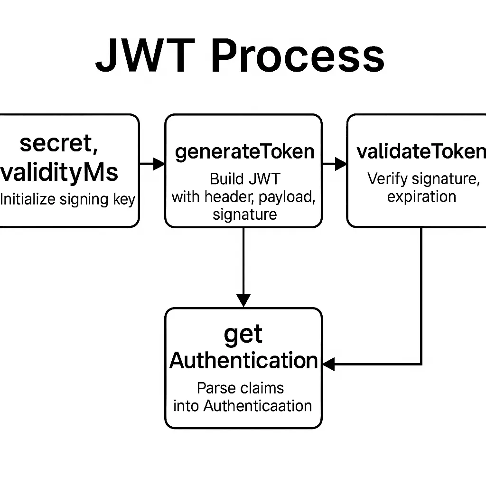

## JwtTokenProvider

```java
    private final String secret;
    private final long validityMs;
    private Key key;

    public JwtTokenProvider(
            @Value("${jwt.secret}") String secret,
            @Value("${jwt.expiration}") long validityMs
    ){
        this.secret = secret;
        this.validityMs = validityMs;
    }
    
    
    @PostConstruct
    public void init(){
        this.key = Keys.hmacShaKeyFor(secret.getBytes(StandardCharsets.UTF_8));
    }

```

- init()  빈 초기화(생성자 호출 및 의존성 주입)가 모두 끝난 **직후** 실행되는 메서드임을 표시

### 토큰 생성 generateToken(Authentication auth)

- JWT 헤더 설정
- 페이로드 설정
- 비밀키로 서명

```java
 public String generateToken(Authentication authentication){
        Date now = new Date();
        Date exp = new Date(now.getTime() + validityMs);

        List<String> roles = authentication.getAuthorities().stream()
                .map(Object::toString)
                .toList();

        return Jwts.builder()
                .setHeaderParam(Header.TYPE, Header.JWT_TYPE)
                .setSubject(authentication.getName()) // 로그인한 사용자 이름 
                .claim("roles", roles) // 권한 목록
                .setIssuedAt(now) // 발행 시간
                .setExpiration(exp) // 만료시간
                .signWith(key, SignatureAlgorithm.HS256) // HS256 서명
                .compact(); // 문자열 반환 
    }
```

## 토큰 검증 validateToken(String token)

- 서명 유효성 확인 → 토큰 위변조 방지
- 만료시간 확인 → 토큰 재사용 방지
- 예외처리 → 만료, 구조 오류, 지원되지 않는 알고리즘 등

```java
    public boolean validateToken(String token){
        try{
            Jws<Claims> claims = Jwts.parserBuilder()
                    .setSigningKey(key)
                    .setAllowedClockSkewSeconds(60) // 서버간 시계 오차 1분 허용 
                    .build() 
                    .parseClaimsJws(token); // 서명 & 만료 검사

            // 만료 시간이 현재보다 이전인지 확인 
            return  !claims.getBody().getExpiration().before(new Date());
        }catch (JwtException | IllegalArgumentException e){
            log.warn("Invalid or expired JWT : {}", e.getMessage());
            return false;
        }
    }
```

## Authentication 생성(인증 정보 추출)

- 페이로드에서 sub 추출 → UserDetails 조회
- 권한 정보(roles) 매핑 → GrantedAuthority 리스트 생성
- UsernamePasswordAuthenticationToken 형태로 리턴

```java
   public Authentication getAuthentication(String token){
        // 1. 페이로드 꺼내기 
        Claims claims = Jwts.parserBuilder()
                .setSigningKey(key)
                .build()
                .parseClaimsJws(token)
                .getBody();

        // 2. 사용자 이름 가져오기
        String username = claims.getSubject();

        @SuppressWarnings("unchecked")
                // 3. 권한 문자열을 Spring-Security가 이해하는 GrantedAuthority 객체로 변환
        Collection<SimpleGrantedAuthority> authorities = ((List<String>) claims.get("roles"))
                .stream()
                .map(SimpleGrantedAuthority::new)
                .toList();

        // 4. principal : 사용자 이름 혹은 UserDetails
        // credentials : 토큰 혹은 null
        // authorities : 권한 목록 
        // 추후 이 객체를 SecurityContextHolder에 담아 인가 필터에서 권한 검사에 활용
        return new UsernamePasswordAuthenticationToken(username, token, authorities);
    }
```

---

## JWT 발급-검증 과정

### 1. secretkey를 통해 key를 생성

### 2. generateToken을 이용해 토큰 상자를 만듬

- 로그인 성공시 바로 만듬
- 상자 안에는
    - sub : 토큰 주인 아이디 (inho)
    - roles : 권한 (admin / user)
    - iat (발행시간) exp(만료시간) : 지금시간부터 1시간동안만 유효
- 이후 상자에 key로 위조를 막음
- 결과적으로 세 부분이 .으로 이어진 긴 문자열(JWT)이 되고 클라이언트(브라우저)에게 보냄

### 3. validateToken 토큰 상자 확인하기

- 모든 보호된 API에 요청이 들어올 때마다
- 상자(JWT)를 자물쇠(Key)로 열어봄
- 이 자물쇠가 진짜 내 열쇠가 맞는지, 만료시간이 지나지 않았는지
- 결과적으로 모두 Ok라면 계속 진행
- 서명 잘못됐거나 만료시 → false

### 4. getAuthentication 인증 정보 꺼내기

- 상자 안 내용 꺼내기
    - 자물쇠 확인이 끝난 상자에서 주인 이름(sub)와 권한(roles)를 꺼낸다
- 스프링 보안 전용 Authentication 상자
    - 꺼낸 정보로 내가 이사람이 맞다는 표시를 만들고
    - SecurityContextHolder라는 장소에 둔다
- 왜?
    - 컨트롤러나 나중의 권한 검사기가 이 요청 누군지 물어볼 때
    - 이 인증정보를 보고 관리자다/일반회원이다 를 판단함

### 한 줄 요약

> 로그인 성공 → JWT 상자 만들고 열쇠(서명) 찍기 → 클라이언트가 상자 보관 → 요청 때마다 상자 확인(열쇠+만료 검사) → 내부 정보 꺼내서 “인증된 사용자”로 표시


